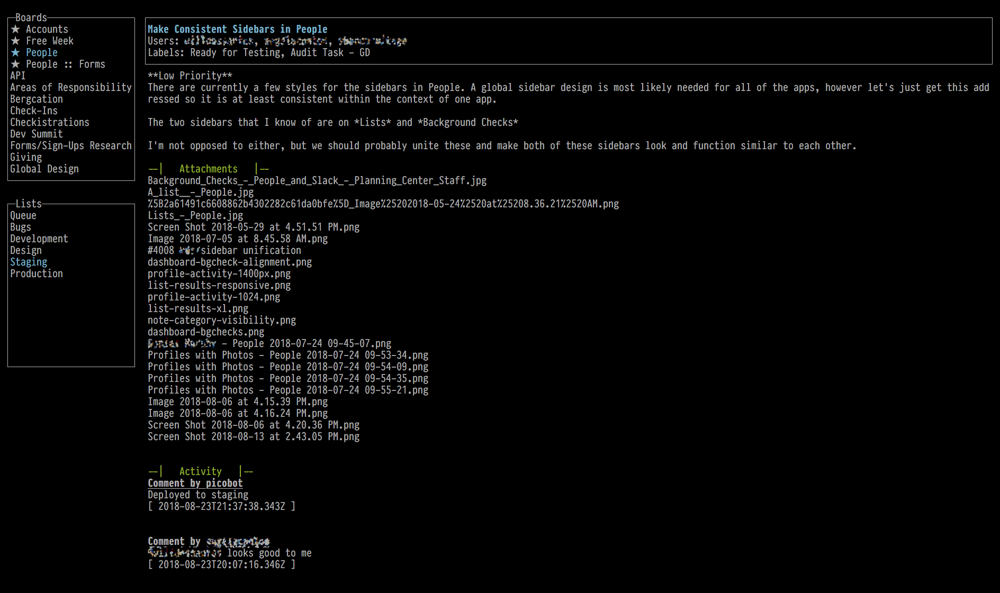

# trello

A CLI app for interacting with Trello.

I personally find Trello's UI offerings to be too taxing on my computer and
the many things it loads in an attempt to look nice make it a bit jumpy and
sluggish. I spend a ton of my day on the command line and wanted an interface with
Trello in that environment.

Add to that my long-time fascination with ncurses apps and a desire to learn Crystal
and the result is this project.



## Installation

For now, you need to build it yourself and you must have the
[Crystal language installed](https://crystal-lang.org/docs/installation/). You can

1. Clone this repo
   ```sh
   git clone https://github.com/geolessel/trello-cli.git
   ```
2. Build the app (in the `trello-cli` directory)
   ```
   crystal build --release src/trello.cr
   ```

   This will make a `trello` executable that you can then run.
   ```
   ./trello
   ```
3. [Get an API token from Trello](https://trello.com/1/authorize?expiration=never&scope=read,write&response_type=token&name=trello-cli&key=3020057fffe933d81fe081eb4f8d126a)
4. Create a `.trello-cli` directory in your `$HOME` directory (like `/Users/geolessel`)
   ```sh
   mkdir ~/.trello-cli
   ```
5. Create a `~/.trello-cli/secrets.json` file in and add keys
   and values for `key` (your Trello API key), `token` (your Trello API token),
   and `memberId` (your Trello member id).
   ```json
   {
     "token": "YOUR TRELLO TOKEN",
     "memberId": "YOUR MEMBER ID"
   }
   ```

   You can get your member id by visiting this URL:
   https://api.trello.com/1/members/me?key=3020057fffe933d81fe081eb4f8d126a&token={YOUR_TOKEN}

   This will return JSON and inside of that, you can find your `"id"`.

## Usage

1. Run it!
   ```sh
   trello
   ```

## Development

TODO: Write development instructions here

## Contributing

1. Fork it (<https://github.com/geolessel/trello/fork>)
2. Create your feature branch (`git checkout -b my-new-feature`)
3. Commit your changes (`git commit -am 'Add some feature'`)
4. Push to the branch (`git push origin my-new-feature`)
5. Create a new Pull Request

## Contributors

- [geolessel](https://github.com/geolessel) Geoffrey Lessel - creator, maintainer
